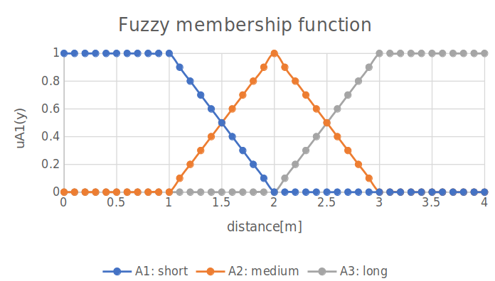
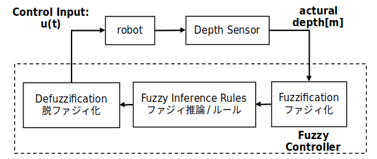
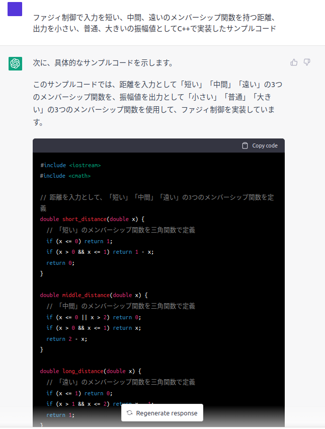

# fuzzy controller
ROS2 package for fuzzy control.

This package uses:
- Fuzzy membership function for trigonometric functions



- Fuzzy controller



- C++ Program generated from chatGPT



## Requirements
- Linux OS
    - Ubuntu 20.04 Laptop PC
- ROS
    - Foxy Fitzroy

## Install & Build
The following commands download a package from a remote repository and install it in your colcon workspace.

```
mkdir -p ~/manta_ws/src
cd ~/manta_ws/src
git clone https://github.com/tasada038/fuzzy_controller.git
cd ~/manta_ws && colcon build --symlink-install
```

## Usage
1. Interactive fuzzy control
```
ros2 run fuzzy_controller ts_fuzzy_test1
```

2. Display Iuput Control 'u(t)' for specified distance
```
ros2 run fuzzy_controller ts_fuzzy_test1
```

3. TS Fuzzy controller for /scan topic input
```
ros2 run fuzzy_controller ts_fuzzy_controller
```

/scan from Realsense D435 is used as an example entry for the /scan topic.

### ts_fuzzy_controller parameter
The parameters for the ts_fuzzy_controller are as follows.
```
$ ros2 param list
/ts_fuzzy_node:
  dist_max
  dist_mid
  dist_min
  dist_range
  use_sim_time
  weight_1
  weight_2
  weight_3
```

## License
This repository is licensed under the Apache 2.0, see LICENSE for details.